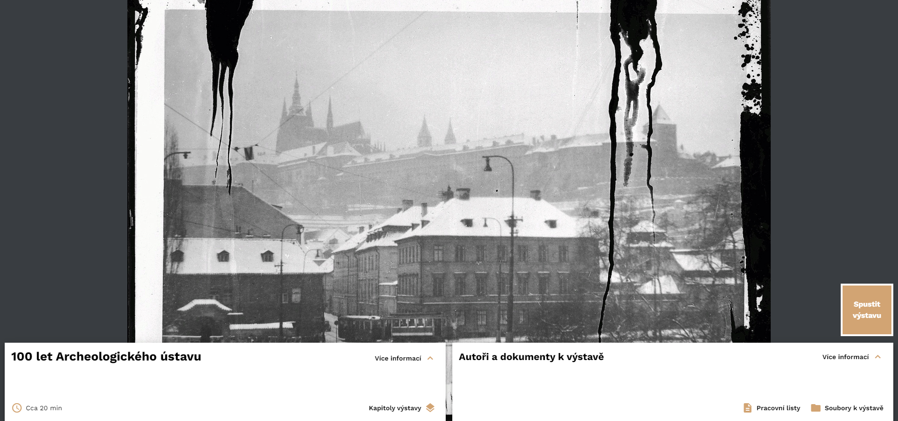
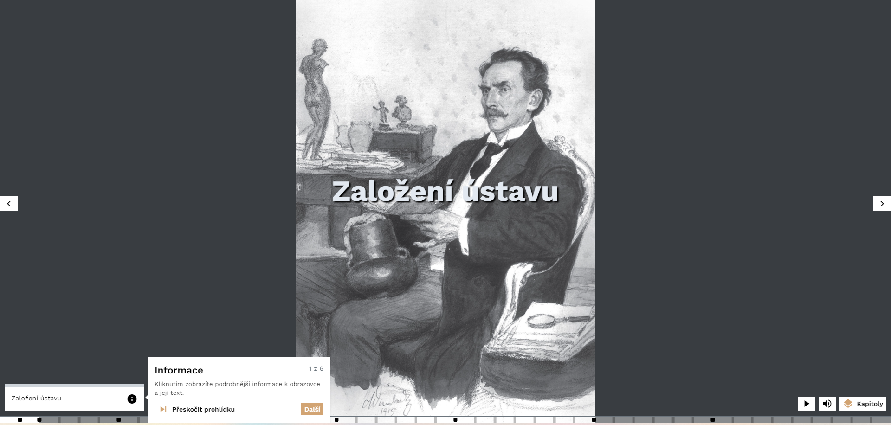

# O nástroji INDIHU Exhibition

INDIHU Exhibition umožňuje jednotlivcům nebo týmům vytváření virtuálních
výstav na zcela libovolná témata. Má širokou škálu použití pro instituce
zprostředkovávající kulturní dědictví. Lze použít i pro neotřelou online
prezentaci výstupů vědeckého bádání. Může sloužit i jako nástroj pro
žáky a studenty, kteří v něm mohou zpracovávat školní práce.

INDIHU Exhibition je open source software
(<https://github.com/LIBCAS/INDIHU>) a webová služba dostupná na adrese
<https://exhibition.indihu.cz/>, kterou provozuje Knihovna Akademie věd
ČR.

!!! question "Proč používat INDIHU Exhibition?"
    * Umožní tvořit virtuální výstavy, aniž byste museli rozumět webdesignu
    * Poskytuje širokou škálu obsahu od obrázků, přes video, texty 
    * Nabízí zařazení interaktivních her
    * Dovoluje soustředit se na obsah a ne na technickou stránku
    * Ušetří Vám peníze za programátory

## Co to umí 

- Obrázky (animace, různé přechody, před a po, fotogalerie)
- Infopointy (stručné informační boxy v obrázcích)
- Video
- Text 
- Audio (hudba, audio komentáře)
- Vkládání externího obsahu (např. mapy, videa, grafy, 3D objekty) 
- [Minihry](minihry.md) (Kvíz, Najdi na obrázku, Stírací los, Hádej velikost apod.)
- Přikládání souborů s dalšími materiály (např. seznam literatury, pracovní listy pro školy)
- Na tvorbě výstavy můžete spolupracovat s více tvůrci
- Hostování výstavy
- Snadné sdílení návštěvníkům i spoluatorům
<!-- - Responzivní design (základní prvky výstavy jsou vhodné i pro mobilní zařízení) -->

## Jak začít?

Tvorba virtuálních výstav má dvě části. Nejprve je třeba [vybrat téma](obsah-vystavy.md) a obsah připravit tak, aby byl vhodný pro zpracování formou virtuální výstavy. Druhým krokem je příprava výstavy v nástroji INDIHU Exhibition. V osvojení nástroje doporučujeme postupovat takto: 

1. [Koncepce editoru](koncepce-editoru.md): článek a videa, která představují hlavní myšlenky a obecné principy ovládání
2. [Základní fungování](zaklady.md): Vysvětlení používaných pojmů a ilustrovaný popis jednotlivých kroků při založení první výstavy
3. [Obrazovky](obrazovky.md): Podrobný ilustrovaný popis jednotlivých tipů obrazovek
4. [Minihry](minihry.md): Podrobný ilustrovaný popis jednotlivých interaktivních her

## Jak výstavu vidí návštěvník

Na úvodní stránce najdete klíčové informace o virtuální výstavě jako její přibližnou délku, jednotlivé kapitoly, její autory a v případě, že je autor vytvořil, tak i doplňující dokumenty k výstavě.

Jakmile zahájíte výstavu tlačítkem "Spustit výstavu," automaticky se zahájí infoprohlídka, která vás postupně provede ovládacími prvky výstavy včetně užitečných klávesových zkratek.

<ins>Průchod výstavou

Při průchodu výstav v Indihu Exhibition můžete narazit na dva typy výstav. Prvním typem je výstava, která bude tvůrcem **načasovaná** a poběží vám tak v prohlížeči sama od sebe kapitolu po kapitole. Druhým typem je pak výstava, která takové načasování nemá a její ovládání je zcela na vás a **vašem tempu**. V každém případě je však vždy možné výstavu pozastavit nebo se k jednotlivým obrazovkám vrátit.

<ins>Statické x Interaktivní obrazovky

Virtuální výstavy mají několik druhů obrazovek, které se dají obecně zařadit dvou typů - statické a interaktivní. Jak už název napovídá, při statických není třeba aktivita návštěvníka, ale v interaktivních ano. Jedná se například o [minihry](minihry.md), jako je kvíz, nebo posuň na správné místo. Tyto typu obrazovek slouží k aktivizaci návštěvníka, v žádném případě však není jejich vyplnění povinné a dají se přeskočit.

TODO: fotky nového kvízu