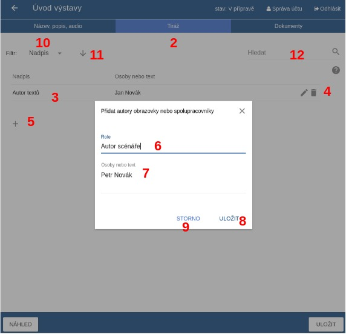
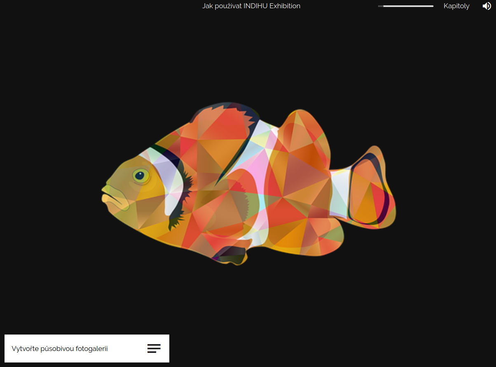
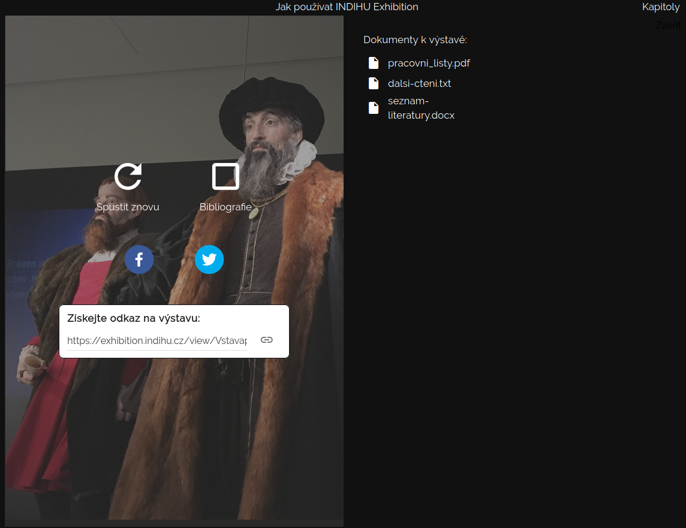

# Obrazovky

Základním stavebním kamenem virtuální výstavy, kterou tvoříte, jsou obrazovky. Postupně si projdeme jednotlivé typy obrazovek, jejich funkcionality a možnosti použití. Pokud hledáte informace ke konkrétnímu typu obrazovky, použijte navigaci vpravo. Obrazovky plníte obsahem a sdružujete do kapitol a tím vznikne výstava. Výstava může být složená jen za pomocí jednotlivých obrazovek bez organizace do kapitol. Nabízíme 3 druhy obrazovek: 

- Obsahová obrazovka 
- Interaktivní obrazovka
- [Herní obrazovka](hry)

# Obsah společný pro včechny obrazovky 

Každá obrazovka začíná záložkou s názvem **Název a text** kde vyplňujete název obrazovky. V názvu shrňte, o čem obrazovka pojednává a usnadněte tak návštěvníkovi orientaci v tématu. Název se zobrazí v editoru ve výpisu obrazovek a vidí ji i návštěvník v levém dolním rohu, kde si může otevřít textové pole s dalšími informacemi k tématu. 

Vyplňte Text k tématu, pokud chcete sdělit nějaké informace o tom, na co se návštěvník dívá nebo chcete dodat širší kontext. Text se zobrazí v textovém poli po kliknutí na název obrazovky. Sledujte informace o délce textu. Po finalizaci textu můžete obsah nahrát jako audio, které si návštěvník poslechne. Audio a i text však nemusí mít stejný obsah.

!!! info "Tip"
    K orientaci vám při vytváření výstavy slouží jak názvy obrazovek, tak ikonky vedle názvu, které odkazují na typ obrazovky - např. ikona obrázku, poháru označujíácí hry nebo videa. Díky tomu neztrácíte přehled jak o obsahu, tak o typech obrazovek. Máte informaci o tom, jaké typy obrazovek jdou po sobě a zda se vám obrazovky příliš neopakují. 

**Dokumenty**

K výstavě i ke každí oprazovce je možné přidat dokumenty ideálně ve formátu .docx nebo .pdf, které si návštěvník může stáhnout. **Soubory ke stažení** umožňují přidat rozšiřující informace k výstavě (článek, seznam doporučené literatury, pracovní listy apod.). Dokumenty vybírejte z knihovny dokumentů v editoru nebo je nahrajte z počítače. Druhou variantou je vložit odkaz na web pomocí URL. Web se návštěvníkovi otevře automaticky v novém okně. 

!!! info "Tip"
    Dokumenty je možné přidat k výstavě nebo ke každé obrazovce zvlášť. Nemusíte tedy všechny dokumenty přikládat rovnou na úvodní stránku. Pokud některé dokumenty dáte dovnitř výstavy, snížíte riziko, že bude návštěvník přehlcen množstvím informací na úvodní stránce výstavy. 

!!! warning "Upozornění"
    Podporované formáty pro soubory ve výstavě jsou: video (.mp4 - rozlišení FullHD (1920×1080), 25 snímků za vteřinu, v rendrovacím formátu H.264),audio (.mp3), obrázky (.jpeg, .png), textové dokumenty (.pdf, .txt, .docx). 

Dokumenty jsou k dipozici: 

- na úvodu výstavy
- v textovém poli u každé obrazovky
- na závěrečné obrazovce

TODO - fotky, jak vypadjí přiložené soubory u obrazovky a na konci výstavy a na začátku 

**Časování výstavy**
Doplňte délku trvání obrazovky. To je údaj, který je důležitý pro prezentační mód, protože udává dobu, po kterou se obrazovka automaticky zobrazí. Dejte pozor, aby namluvený komentář nebyl delší než doba trvání obrazovky. 

## Úvod výstavy
Úvodní stránka výstavy obsahuje poměrně hodně informací. Základem je (animovaný) obrázek, název výstavy, informace o tom, kdo výstavu dělal, seznam kapitol, informace o času potřebného k projití výstavy apod. Tvůrce se k editaci dostane ze záložky Struktura výstavy kliknutím na čtvereček úvodu výstavy nebo použitím menu tohoto čtverečku. 

!!! warning "Upozornění"
    Není třeba vyplnit všechny položky hned na začátku tvorby výstavy. Některé informace vyplynou až během procesu vytváření samotné výstavy. 

Obrazovka "Úvod výstavy" má tři záložky, které je třeba postupně naplnit obsahem:

  - Název, popis, audio (1)
  - Tiráž (2)
  - Dokumenty (3)

**Název, popis, audio (1)**

Na této záložce tvůrce vyplňuje základní údaje k výstavě. 

  * Název (4): Název výstavy, který se zobrazí při prohlížení výstavy. Pokuste se názvem zaujmout. 
  * Podnázev (5): Vysvětlující doplněk k názvu. Není třeba vyplňovat. 
  * Perex (6): Text uvádějící výstavu. Měl by být chytlavý a vzbudit v návštěvníkovi zájem, ale zároveň stručný a jednoduchý. Zobrazí se po kliknutí na "Více informací" před spuštěním výstavy. Editor vám ukazuje počet znaků a automaticky vypočítává přibližnou délku, kdyby text byl namluvený jako audio.
  * Obrázek na pozadí (7): Titulní obrázek celé výstavy. 
  * Animace (8): Volba typů animace (Shora dolů, Zdola nahoru a další). Obrázek může být statický a bez animace. 
  * Audio verze výstavy (9): Vznikne složením všech audio komentářů použitých ve výstavě. 
  * Délka trvání výstavy (10): Nastavíte předpokládaný čas trvání výstavy, kterou návštěvník potřebuje k prohlížení. Sečtěte délku trvání jednotlivých obrazovek a k tomu nezapomeňte připočítat dobu potřebnou na hraní her.   
  * Organizace (11): Hlavní instituce, která stojí za tvorbou výstavy. Ostatní zapojené instituce je možné přidat do tiráže.  

!!! info "Tip"
    Pro snadnější sledování postupu prací na výstavě lze všechny obrazovky po dokončení označit jako dokončené (12). Ve výpisu všech obrazovek výstavy se dokončené obrazovky vyznačí zelenou barvou. 

!!! info "Tip"
    Audio verzi výstavy lze uveřejnit jako podcast, což umožní lidem čerpat zajímavé informace i formou poslechu. 

!!! info "Tip"
    Vyzkoušejte na někom, kdo výstavu nezná a nepodílí se na její tvorbě, kolik mu zabere času si ji projít.   

**Tiráž (2)**

Na této záložce tvůrce přidává osoby podílející se na přípravě výstavy. 

Tiráž je navržena tak, aby tvůrce mohl volně přidávat spolupracovníky a přiřazovat jim popis spolupráce dle potřeby. Jednotliví autoři se zobrazují v řádcích (3). Pomocí ikonky tužka (4) lze text upravit a pomocí koše (4) smazat. Pro přidání dalšího spolupracovníka použijte ikonku + (5). Po kliknutí na ikonu + se zobrazí vyskakovací okno, kde do prvního řádku Role (6) napíšete, co konkrétní osoba dělala. Do druhého řádku Osoby nebo text (7) napíšete jméno nebo jinou krátkou informaci. Přidání další osoby do tiráže potvrdíte tlačítkem Uložit (8). Pro zrušení akce použijte tlačítko Storno (9). Pomocí šipek nahoru/dolů lze upravovat pořadí osob v tiráži.  

## Úvod do kapitoly
Každá nová kapitola je otevřena titulní stránkou. Obsahuje název a titulní obrázek. Obrázek může být animovaný. Editor má tři záložky, které je třeba naplnit obsahem:

  - Název, audio
  - Obrázek na pozadí
  - Dokumenty

**Název, audio**

Na hlavní záložce vyplníte základní údaje ke kapitole – název a podnázev. Výběrem z dokumentů lze vybrat dvě zvukové stopy. Pro celou kapitolu a pro úvodní stránku kapitoly. Zvuková stopa pro celou kapitolu je přehrávána ve smyčce po čas průchodu všemi stránkami kapitoly. Zvuková stopa pro úvodní stránku kapitoly je přehrána pouze jednou a definuje svou délkou i délku animace obrázku a celkově délku setrvání na této stránce při prohlížení v prezentačním módu. Tuto délku v sekundách lze manuálně změnit, pokud vám automaticky vypočtená délka nevyhovuje.

!!! failure "Pozor"
    Tvorba mluveného komentáře je produkčně poměrně náročná. Proto doporučujeme audio komentář nahrávat až jako poslední, když jste s celou výstavou spokojeni a prošla testováním. 

**Obrázek na pozadí**

Vyberte obrázek z dokumentů, který uvodí téma kapitoly. V případě, že obrázek nemáte nahraný do editoru, nahrajte jej pomocí správce souborů. Pokud chcete, vyberte typ animace. Zkuste více druhů animace a vyberte, která vám bude nejvíce vyhovovat. 

## Obsahové obrazovky 

### Obrazovka s obrázkem

Obrazovka s obrázkem je jednou ze základních obrazovek. Hlavním obsahem je tedy obrázek. Obrazovka s obrázkem je relativně snadná na přípravu a je efektní. Doporučujeme použití tzv. infopointů, které obohatí obrázek o informační hodnotu. Infopointy jsou určeny ke zvýraznění určitého detailu nebo motivu na obrázku tím, že na konkrétní místo vložíte ikonu s otazníkem a krátký text s vysvětlením, zajímavostí či upozorněním. Text se návštěvníkovi zobrazí, když na ikonu s otazníkem najede myší nebo jej můžete označit jako Stále zobrazen. V tom případě bude vidět i bez najetí myší. Na jeden obrázek je možné vložit více infopointů. Infopoint se zobrazí v levém horním rohu, odkud ho přetáhněte myší na jakékoli místo v obrázku.  

!!! info "Tip"
    V případě, že dáváte více obrazovek s obrázkem za sebe zvažte, zda raději nepoužijete typ obrazovky [Fotogalerie](https://nnis.github.io/indihu-manual/obrazovky/#fotogalerie). 

**Obrázek**

Vyberte obrázek z dokumentů. V případě, že obrázek nemáte nahraný do editoru, nahrajte jej pomocí správce souborů. Pokud chcete, vyberte typ animace. Zkuste více druhů animace a vyberte, která vám bude nejvíce vyhovovat. Pomocí tlačítka + přidejte infopointy a doplňte k nim stručné vysvětlení. Infopoint se zobrazí v levém horním rohu, odkud ho přetáhněte myší na jakékoli místo v obrázku. Pokud zaškrtnete možnost Stále zobrazen, bude text infopointu vidět rovnou. V opačném případě se text návštěvníkovi zobrazí, když na ikonu s otazníkem najede myší. Po kliknutí mimo infopoint text zmizí. Na jeden obrázek je možné vložit více infopointů.

### Obrazovka s videem

Hlavním obsahem této obrazovky je video, které nahrajete do souborů z počítače. Ve výstavě se video zobrazí na celou stránku, proto jsou lepší videa orientovaná na šířku. Video připravujte v rozlišení FullHD (1920×1080), 25 snímků za vteřinu, v rendrovacím formátu H.264.  

Zaškrtnete-li pole Vypnout zvukovou stopu kapitoly, nebude na této obrazovce zvuk pokreslující celou kapitolu, ale pustí se zvuk ve videu. 

**Video**

Vyberte video z nahraných souborů nebo jej vyberte z počítače a přidejte do správce souborů. Nahrávání videa funguje stejně jako nahrávání ostatních typů obsahu. 

!!! info "Tip"
    Ve výstavě můžete použít i video, které jste umístili na internet, např. na YouTube na Vimeo a to pomocí embed kódu. V tom případě použijte [Obrazovku s externím obsahem](https://nnis.github.io/indihu-manual/obrazovky/#obrazovka-s-externim-obsahem). 

### Obrazovka s textem

Obrazovka s textem umožňuje sepsat text na libovolné téma o max. délce 300 znaků. Text je bílý na černém pozadí, je umístěn do středu stránky se zarovnáním vlevo. Velikost textu se upravuje automaticky podle jeho délky - kratší text je větším písmem, delší text naopak menším. Pozice textu se upravuje podle jeho délky.

!!! info "Tip"
    Jedním z možných použití je, že v textu shrnete část výstavy, upozorníte na to nejdůležitější, co návštěvníci viděli. Další možností je prezentace citací a přímé řeči. 

!!! info "Tip"
     Typ písma je předem dána, i jeho velikost a pozice se automaticky upravuje. Nicméně můžete text formátovat pomocí těchto html značek: &lt;b&gt;**pro tučný text**&lt;/b&gt; &lt;i&gt;*pro text kurzívou*&lt;/i&gt;.

V případě obrazovky s textem, jejímž hlavním obsahem je text, zvažte vyplnění záložky text. Text se zobrazí v textovém módu, v prezentačním vidět není. Sledujte informace o délce textu. Po finalizaci textu můžete obsah nahrát jako audio, které si návštěvník poslechne v prezentačním módu. Audio a i text však nemusí mít stejný obsah. 

**Text**

V záložce Text dodáte hlavní obsah stránky, tedy text. Text je bílým písmem na černém pozadí. Velikost písma je automaticky upravována. 

### Parallax

Parallax je dynamický efekt, který oživí virtuální výstavu. Spočívá v tom, že je obrázek rozdělen na nejméně 2 vrstvy - popředí a pozadí. Tyto vrstvy jsou animovány rozdílnou rychlostí, čímž vzniká iluze 3D, ačkoli se jedná stále o obrázek. Příklady tohoto efektu najdete např. na [YouTube](https://www.youtube.com/watch?v=cUfmUPhApJ0). 

Pomocí vkládání obrázků po vrstvách vytvoříte parallax. Obrázky si nahrajte do systému z počítače pomocí správce souborů. V případě parallaxu je třeba obrázky jednotlivých vrstev upravit a ořezat, viz následující obrázek z editace. Nejdůležitějším obrázkem je podkladový obrázek, na jehož výběr dbejte. 

Vyzkoušejte, jaká animace bude vypadat nejlépe. Máte na výběr z několika typů - Shora dolů, Zdola nahoru, Zleva doprava, Zprava doleva. 

Ukázku, jak může vypadat parallax, uvidíte v následujícím videu. 

<iframe width="560" height="615" src="https://www.youtube.com/embed/XoykDUe2ItI" frameborder="0" allow="accelerometer; autoplay; encrypted-media; gyroscope; picture-in-picture" allowfullscreen></iframe>

### Animace přiblížení

Obrazovka Animace přiblížení je velmi efektivní způsob, jak na jednom obrázku návštěvníkovi zdůraznit určité detaily včetně možnosti tyto detaily okomentovat. Statickou obdobou podobné funkcionality je obrázek, do kterého přidáte infopointy s informačním boxíkem. Na rozdíl od infopointů, které si uživatel nemusí rozkliknout, u této obrazovky o detailní pohled nepřijde. Mezi jednotlivými detaily se animace vždy vrátí na celek obrázku.   

!!! info "Tip"
    Načasování plynutí výstavy věnujte velkou pozornost. Zvolte u každé obrazovky takový čas, aby měl návštěvník prostor si prohlédnout obsah, ale zároveň aby se nezačal nudit. Doporučujeme vyzkoušet načasování jednotlivých obrazovek s testovacími návštěvníky. 

**Sekvence**

Vyberte příslušný obrázek nebo jej přidejte do souborů z počítače. Místa, která se v animaci přiblíží označte infopointem, který metodou drag and drop přetáhnete myší na vybrané místo. Infopoint se objeví vždy v levém horním rohu. Seřazením bodů za sebe vytvoříte sekvenci. Ke každému bodu můžete dát popisek a určit délku, po jakou bude detail přiblížen. Nezapomeňte určit, kde se popisek zobrazí. Na výběr máte ze dvou možností; vpravo dole nebo vlevo nahoře.  

## Interaktivní obrazovky 

### Slideshow

Fotogalerie je typ obrazovky, která je v hodná k prezentování více obrázků, které spolu souvisí. V případě, že vkládáte za sebe více Obrazovek s obrázkem, zvažte využití Fotogalerie, protože výsledný dojem bude plynulejší. Umožní vám to také okomentovat více fotografií v jednom textu nebo jedním audio komentářem. To ulehčí i editaci a práci s audiosoubory. 

!!! warning "Upozornění"
    U určování Celkové doby zobrazení obrazovky v případě Fotogalerie postupujte tak, že si zvolte čas na zobrazení jedné fotky a ten vynásobte počtem snímků. Příklad: při čtyřech fotkách a 20 vteřinách bude každá fotografie zobrazena 5 vteřin. 

!!! info "Tip"
    Načasování plynutí výstavy věnujte velkou pozornost. Zvolte u každé obrazovky takový čas, aby měl návštěvník prostor si prohlédnout obsah, ale zároveň aby se nezačal nudit. Doporučujeme vyzkoušet načasování jednotlivých obrazovek s testovacími návštěvníky. 

**Slideshow**

Při vkládání obrázků postupujte stejně jako u Obrazovky s obrázkem nebo u práce se soubory. Vyberte příslušný obrázek z adresáře nebo jej nahrajte do správce souborů. Další obrázek do fotogalerie přidáte kliknutím na čtverec s ikonou +. 

Ke každé fotografii můžete přidávat infopointy. Zvolte také způsob animace. Na výběr máte z více typů - Bez animace, Bez animace s rozmlženým pozadím, Pozvolné objevení, Pozvolné objevení s rozmlženým pozadím, Zleva doprava, Zleva doprava s rozmlženým pozadím. Rozmlžené pozadí vyplní celou obrazovku na fullscreen.  

!!! info "Tip"
    Zvažte také využití obrázku s průhledným pozadím. Pozadí potom bude černé a obrázek hezky vynikne. 
    

### Foto před a po

Obrazovka Před a po je jedním z prvků výstavy, který vybízí návštěvníka k aktivitě. Je složena ze dvou obrázků, které jsou vidět jen z půlky. Uprostřed obou obrázků je táhlo, s kterým návštěvník posouvá a tím si zobrazuje. Obrazovka Před a po je ideálním prostředkem, jak zdůraznit změnu a rozdíly, kterých by si návštěvník nemusel všimnout. Nabízí se třeba při prezentaci stejného místa v různých dobách. Zároveň je možné obrazovku využít i k vytvoření vtipů a hříček, kdy do jednoho obrázku vložím něco, co na původním není a tento rozdíl se objeví až přetažením táhla.

!!! info "Tip"
    Vyzkoušejte různé druhy přechodů. Pozvolný přechod působí zcela odlišným dojmem než když použijete táhlo, kterým hýbe sám uživatel. Právě pozvolný přechod u obrazovky Před a po může být využit místo složitějších animací. 

Doplňte délku trvání obrazovky. To je údaj, který je důležitý pro prezentační mód, protože udává dobu, po kterou se obrazovka automaticky zobrazí. Dejte pozor, aby namluvený komentář nebyl delší než doba trvání obrazovky. 

**Obrázky**

Editace obrazovky spočívá ve výběru dvou obrázků ze souborů k výstavě. Pokud nemáte soubor v editoru, nahrajte jej ze svého počítače. Nástroj obsahuje i jednoduchý editor obrázků(DODAT ODKAZ), který je dostupný v adresáři souborů přes menu u každého obrázku. Po tom, co máte vybrané obrázky, vyberte způsob přechodu - Myš nad obrázkem, Kliknutí na obrázek, Horizontální táhlo, Vertikální táhlo, Pozvolný přechod. 

### Obrazovka s externím obsahem

Obrazovka s externím obsahem je nástroj, jak do výstavy pomocí embed kódu vložit obsah, který je umístěný jinde na internetu nebo jste jej vytvořili pomocí jiného nástroje, který tento typ sdílení umožňuje. Zároveň si takový obsah zachovává své původní funkcionality. Takto je možné sdílet např. mapu, interaktivní grafy, videa apod. 

!!! info "Tip: Mapa"
    Vložená mapa např. ze služby Google maps si zachovává možnost přiblížení a oddálení. V embed kódu je také možné nastavit velikost mapy - v tomto případě byla ručně velikost zvětšena na fullscreen, tedy na 1920 na 1080 px. Editace s vložením kód potom vypadá třeba takto: DODAT SREENSHOT Z EDITACE
    Návštěvník pak vidí mapu takto: 
    

!!! info "Tip: Video"
    Vložené video např. ze služby YouTube si může návštěvník spustit. V embed kódu je také možné nastavit velikost videa - v tomto případě byla ručně velikost zvětšena 1060 na 815 px. Editace s vložením kód potom vypadá takto: DODAT SREENSHOT Z EDITACE
    Návštěvník pak vidí obrazovku následovně: 
    
    Využití embedovaného videa je vhodné, pokud máte video vyexportované ve formátu, který není editorem podporován a nemůžete jej znovu vyexportovat. Na druhou stranu vložené video může působit jako cizorodý element a na některé návštěvníky to může působit tak, že byla narušena integrita virtuální výstavy. 

!!! info "Tip: Interaktivní grafy"
    Grafy jsou účinnými nástroji vizualizace informací a dokáží návštěvníkovi předat velké množství informací zajímavou formou. Využití grafů může vypadat třeba takto: 
    
    Tento graf byl vytvořen pomocí služby [Inforgram](https://infogram.com/). Konkrétní čísla a informace se zobrazí, když na část grafu návštěvník najede myší. Kromě grafů můžete vytvářet v tomto nástroji i mapy s informacemi. 

!!! info "Tip: 3D objekt"
    Máte-li k dispozici digitalizované objekty ve 3D, je možné pomocí embed kódu vložit do výstavy i je. Návštěvník si může pomocí myši s objektem otáčet a dívat se na něj ze všech stran. Někdy 3D modely obsahují i textové informace.   
    
    
Doplňte délku trvání obrazovky. To je údaj, který je důležitý pro prezentační mód, protože udává dobu, po kterou se obrazovka automaticky zobrazí. Dejte pozor, aby namluvený komentář nebyl delší než doba trvání obrazovky. 

**Externí data**

Sem vložte embed kód stránky nebo služby. 

!!! info "Tip"
      
    Často jej najdete v možnostech sdílení. Bývá označen &lt; &gt; nebo &lt; / &gt; 
    V případě, že je na výběr více typů embed kódů, vyzkoušejte ty, které fungují nejlépe. Responsive kód nemusí fungovat, ale Fixed naopak ano. 

## Závěr výstavy  

TODO - nové funkce, dopsat. Obrazovka Závěr výstavy se generuje automaticky nebo tam můžete nahrát jakýkoli obrázek. Je na ní zopakován obrázek z úvodní stránky k výstavě, tentokrát však bez animace. Obrazovka obsahuje možnost přehrát si výstavu znovu pomocí šipky Spustit znovu. Dále je možné ji sdílet ostatním na Facebook a Twitter a získat URL odkaz na výstavu. 

Po kliknutí na ikonu s názvem Soubory k výstavě vyjede panel se seznamem souborů, které si návštěvník může stáhnout do počítače. 

!!! info "Tip"
    Přikládáte-li k výstavě soubory, dbejte na jejich srozumitelné pojmenování, aby návštěvník věděl, co si stahuje. 
