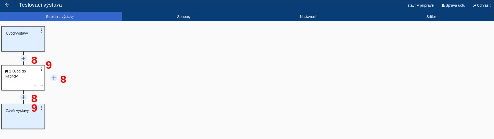

# Základní fungování

## Vysvětlení pojmů

### Virtuální výstava

Virtuální výstava je základním konceptem systému. Jedná se o ucelenou
prezentaci určitého tématu, kterou vytvoříte pomocí obrazových,
textových, audiovizuálních informací a interakce. Software INDIHU
Exhibition je nazýván editorem výstav.

### Tvůrce

Tvůrce je člověk, který tvoří výstavu.

### Návštěvník

Pojmem "návštěvník" je označován uživatel, který navštíví web s
virtuální výstavou.

### Obrazovka

Výstava je tvořena jednotlivými obrazovkami. Na obrazovkách může být
různý obsah - obrázky, minihry, videa atd. V dalších částech manuálu
(ODKAZ) se seznámíte s jednotlivými typy obrazovek a jejich ovládáním
(např. Obrazovka s textem, Obrazovka s videem, Fotogalerie apod.). Při
tvorbě výstavy postupně plníte obrazovky obsahem. Editor umožňuje
označit obrazovku jako dokončenou, díky tomu si lépe udržíte přehled o
tom, které obrazovky ještě musíte dodělat.

### Kapitola

Obrazovky je možné sdružovat do kapitol. Výstava však může být jen série
po sobě jdoucích obrazovek. Mezi jednotlivými kapitolami mohou být
samostatné obrazovky. Tvoření kapitol je nástrojem pro logické členění
obsahu. Výstava může obsahovat jednu či více kapitol.

Kapitola vždy obsahuje úvodní stránku kapitoly s názvem a titulním
obrázkem, který může být animovaný. Návštěvník může při prohlížení
výstavy přeskakovat z jedné kapitoly do druhé skrze seznam "Kapitoly" v
menu.

### Minihra

Speciálním typem obrazovek jsou Minihry. Minihry jsou interaktivní
prvky, kdy je návštěvník postaven před řešení úkolu - např. má najít
určité místo na obrázku nebo odkrýt obrázek). K realizaci miniher
(ODKAZ) je třeba adekvátně připravit obsah.

## Princip ovládání editoru

1.  Registrace tvůrce: Pro využívání INDIHU Exhibition jako webové
    aplikace je třeba se zaregistrovat na adrese
    <http://inqooltest.libj.cas.cz>. Po vyplnění registračního formuláře
    je třeba registraci potvrdit pomocí odkazu zaslaného na zadaný
    e-mail. Tím vznikne žádost o vytvoření účtu, která je schválena
    administrátorem. Po schválení žádosti vzniká uživatelský účet s rolí
    Editor. O postupech v procesu registrace je žadatel informován
    emailovými notifikacemi.
2.  Přihlášení do editoru: Tvůrce se přihlašuje uživatelským jménem
    (e-mail) a heslem, které si zvolil při registraci. Tvůrce má možnost
    změnit svoje osobní údaje, heslo nebo zrušit účet pomocí tlačítka
    “Správa účtu”, které se nachází na pravé straně záhlaví.
3.  Založení výstavy
4.  Tvorba jednotlivých obrazovek
5.  Zveřejnění výstavy
6.  Ukončení výstavy

Tvůrce může mít v jednu chvíli více rozpracovaných výstav.

### Seznam virtuálních výstav

Po přihlášení do editoru se zobrazí seznam výstav. Tyto výstavy buď byly
vytvořeny tvůrcem, nebo od jiného tvůrce získal právo prohlížení nebo
editace.

Výstavy jsou zobrazeny graficky (obr. A) nebo seznam (obr. B). Pro
přepínání zobrazení slouží ikonka v pravém horním rohu (1). Výstavy je
možné filtrovat nebo řadit pomocí přepínačů v horní části okna
(Naposledy použité, Název apod.) (2). Tvůrce může také vyhledávat v
seznamu výstav podle názvu (3).

U každé výstavy jsou uvedeny základní informace, jako jsou: název
výstavy, vlastník výstavy, stav výstavy a datum poslední změny (4).

U každé výstavy jsou pomocí tlačítka (5) k dispozici základní operace
jako je přejmenování výstavy, sdílení výstavy či její části, export
výstavy, změna stavu výstavy, zkopírování výstavy či smazání výstavy.

### Detail výstavy

Po otevření detailu výstavy se tvůrci zobrazí první záložka Struktura
výstavy (1). Lze se přepnout na záložky Soubory (2) pro správu souborů
k výstavě, Nastavení (3) pro obecná nastavení celé výstavy a Sdílení
(4). Po založení výstavy obsahuje obrazovku Úvod výstavy (5), možnost
přidání obrazovky (6) a Závěr výstavy (7).

Všechny změny, které tvůrce na detailu výstavy udělá, jsou okamžitě
ukládány, není zde žádné tlačítko Uložit.

### Struktura výstavy

Každá výstava obsahuje dvě povinné části, obrazovku Úvod výstavy a Závěr
výstavy (viz Detail výstavy). Mezi nimi může být výstava strukturována
do kapitol nebo je možné ji sestavit ze samostatných obrazovek. Každá
kapitola obsahuje povinně úvodní stránku kapitoly a pak další stránky s
obsahem.

Po přidání vybrané obrazovky přidáváte další obrazovky pomocí tlačítka +
(8). Postupným přidáváním dalších obrazovek a jejich přiřazování do
kapitol vznikne výstava.

Struktura výstavy je zobrazená v grafické podobě. Editor umožňuje:

  - Přidávat nové části výstavy
  - Přesouvat stránky a kapitoly
  - Mazat obrazovky 

Každou stránku lze upravovat, zobrazit náhled nebo smazat pomocí menu
(9).

### Soubory výstavy

Každá výstava disponuje svým vlastním souborovým depozitářem, do kterého
si tvůrce může nahrávat soubory potřebné pro tvorbu výstavy. Tvůrce také
může vytvářet adresářové struktury a přesouvat soubory mezi složkami. K
dispozici je náhled obrázku a metadat souboru. Tyto soubory tvůrce dále
využívá při vytváření a editaci jednotlivých stránek, proto je potřebné
zabezpečit co nejvyšší přehlednost dokumentového repozitáře výstavy.

### Nastavení

Záložka obsahuje veškerá nastavení virtuální výstavy, která se týkají
výstavy jako celku:

  - Stav výstavy (1)
  - URL výstavy (2)
  - Informace návštěvníkovi v případě, že je výstava již ukončená (3)

### Stav výstavy

Každá výstava je v jednom z těchto stavů:

1.  V přípravě: Výstava je v přípravě. Obsah výstavy je možné libovolně
    upravovat. Výstava je přístupná pouze přihlášeným tvůrcům, se
    kterými je výstava sdílena.
2.  Zveřejněná: Výstava je veřejně dostupná přes svoje URL. Výstavu není
    možné upravovat. 
3.  Ukončená: Výstava byla ukončena a není ani veřejně dostupná ani
    určena k dalším úpravám. V záložce Nastavení lze v části "Informace
    návštěvníkovi v případě, že je výstava již ukončená" vytvořit
    stránku, která se zobrazí návštěvník, když je tato výstava již
    nedostupná. Výstavu lze znovu převést do stavu V přípravě nebo
    Zveřejněná.

URL výstavy umožňuje nastavit libovolnou koncovku adresy tak, aby byla
dobře použitelná a zapamatovatelná.

### Ukončená výstava

Pokud je výstava ukončená, je možné zobrazit návštěvníkovi náhradní
obrazovku s těmito informacemi:

1.  Obrázek na pozadí
2.  URL pro přesměrování: web, kam je návštěvníkovi doporučeno
    pokračovat (jiná výstava nebo web instituce, která výstavu
    pořádala) 
3.  Oznámení návštěvníkovi: Krátký informační text (např. poděkování za
    zájem)

### Sdílení s dalšími tvůrci

Výstavu lze sdílet s dalšími tvůrci. Ostatním tvůrcům je možné dát práva
jen k prohlížení nebo i k editaci. Můžete přidávat jen tvůrce, kteří
jsou do editoru zaregistrovaní. K přidání další osoby potřebujete znát
možné zaslat e-mailovou pozvánku s výzvou k registraci. O sdílení
výstavy budete informováni e-mailem.

Výstavu je dále možné sdílet odesláním URL adresy výstavy, a to jak
odkazu na titulní obrazovku, tak na libovolnou kapitolu či obrazovku.
Avšak stále platí, že pokud výstava není ve stavu Zveřejněná, nikdo
jiný než ostatní tvůrci ji neuvidí.

### Zamykání výstavy pro editaci

Pokud některý z tvůrců začne výstavu editovat, zamkne tuto výstavu pro
editaci ostatním tvůrcům a to standardně na 1 minutu. Informace o tom,
který tvůrce právě výstavu upravuje, je viditelná jak v seznamu výstav,
tak na detailu výstavy. Ostatní tvůrci mohou výstavu prohlížet, ale ne
upravovat.
